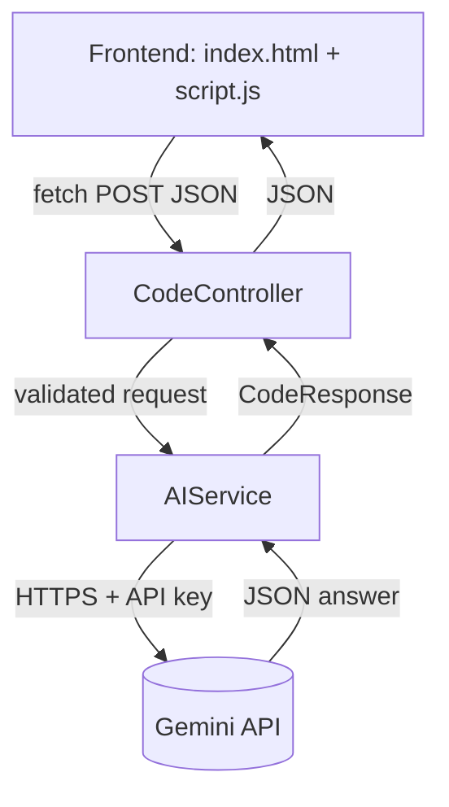

AI Code Explainer

A beginner-friendly **GenAI web app** that explains source code in simple language. Paste your code, choose a language, and get a full breakdown powered by the **Google Gemini API** through a **Java Spring Boot** REST backend.

The app **analyzes** code as plain text. It **never executes** submitted code.

✨ Features

- Code input area with character counter (max 10,000 characters)
- Language dropdown: **Java, Python, C, C++, JavaScript**
- One-click **Explain Code**, plus Clear, loading spinner and friendly error messages
- AI-generated sections:
  - Simple Explanation
  - Line-by-Line Explanation
  - Logic / Algorithm
  - Important Programming Concepts
  - Time and Space Complexity
  - Possible Errors
  - Suggestions for Improvement
  - Improved Code (with Copy Code button)
- **Output Options:** predicted program output, Copy as Text, Download `.txt` / `.md`, Print / Save as PDF
- Dark / light theme and responsive, mobile-friendly layout
- No database needed

✨ Tech Stack

| Layer | Technology |
|---|---|
| Frontend | HTML5, CSS3, Vanilla JavaScript, Fetch API |
| Backend | Java 17, Spring Boot 3.3, Spring Web, REST, Maven |
| GenAI | Google Gemini API (`gemini-2.5-flash`) |
| HTTP client | Spring `RestClient` |

✨ Architecture

| Class | Purpose |
|---|---|
| `CodeController` | Receives `POST /api/code/explain`, validates input, calls the service, returns JSON, handles errors, configures CORS |
| `AIService` | Builds the prompt, calls Gemini, parses the structured JSON answer |
| `CodeRequest` | Incoming data: `language`, `code` |
| `CodeResponse` | Outgoing data: all explanation fields |

✨ Project Structure

ai-code-explainer/

├── README.md

├── .gitignore

├── docs/

│   └── INTERVIEW_PREP.md

├── backend/

│   ├── pom.xml

│   └── src/main/

│       ├── java/com/example/codeexplainer/

│       │   ├── CodeExplainerApplication.java

│       │   ├── controller/CodeController.java

│       │   ├── service/AIService.java

│       │   └── model/

│       │       ├── CodeRequest.java

│       │       └── CodeResponse.java

│       └── resources/application.properties

└── frontend/

    ├── index.html
    
    ├── style.css
    
    └── script.js
    

✨ Sample Tests

| Input | Expected |
|---|---|
| Java class adding `a = 10` and `b = 20` | "Two numbers are added", Time O(1), Space O(1), output `30` |
| `for(int i = 0; i < 10; i++) { System.out.println(i); }` | Loop explained, Time O(n) (or O(1) for a fixed 10, if explained) |
| Empty input | `Please enter some code.` |
| Backend stopped | `Unable to connect to the AI service. Please try again.` |

AI answers can vary slightly between runs, so check that the reasoning makes sense.

✨ Security

- API key lives only on the backend (environment variable)
- Submitted code is treated as plain text and **never executed**; no `eval()`
- Input validation: empty code, language whitelist, 10,000-character limit
- AI output is rendered with `textContent`, so it cannot inject HTML or scripts
- CORS restricted to the local frontend origin
- `.gitignore` excludes `.env` files

✨ Deployment

GitHub Pages only hosts static files, so the app is deployed in two parts:

| Part | Where | How |
|---|---|---|
| Frontend (`frontend/`) | **GitHub Pages** | Automatic via `.github/workflows/pages.yml` on every push to `main` |
| Backend (`backend/`) | A Java host (e.g. Railway, Render) | Set `GEMINI_API_KEY` as an environment variable on the host |

1. Deploy the backend and copy its public URL.
2. In `frontend/script.js`, set `PRODUCTION_API` to `https://<your-backend-url>/api/code/explain`.
3. In the repo go to **Settings → Pages → Source: GitHub Actions**.
4. Push to `main`. The site appears at `https://tharushni-18.github.io/ai-code-explainer/`.

Never commit your API key; add it only in the hosting platform's environment-variable settings.

✨ Troubleshooting

| Problem | Fix |
|---|---|
| `mvn` not recognized | Install Maven and add it to PATH |
| Java version error | Install JDK 17+ |
| Port 8080 in use | Change `server.port` and `API_URL` in `script.js` |
| CORS error in browser | Serve the frontend on port 5500; don't double-click `index.html` |
| "missing the GEMINI_API_KEY" | Set the variable in the same terminal that runs Maven |
| Gemini status 400/403 | Invalid key; create a new one |
| Gemini status 429 | Rate limit; wait a minute |
| Gemini status 404 | Model name changed; update `gemini.model` |

✨ Future Enhancements

- Save explanation history (MySQL)
- Syntax-highlighted editor (e.g. CodeMirror)
- Streaming AI responses
- Login and per-user history
- Rate limiting
- Unit tests with a mocked Gemini service
- Online deployment

